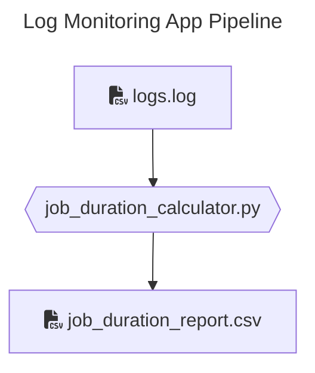

# Log Monitoring Application


The goal of this challenge is to build a log monitoring application that reads the file, measures how long each job takes from start to finish, and generates warnings or errors if the processing time exceeds certain thresholds.  

## Gearing Up for the LSEG Interview Session

### **✅ Goals**
1. **Parse the CSV log file.**
2. **Identify each job or task and track its start and finish times.**
3. **Calculate the duration of each job from the time it started to the time it finished.**
4. **Produce a report or output that:**
    - Logs a warning if a job took longer than 5 minutes.
    - Logs an error if a job took longer than 10 minutes.

### 💻 Local Setup

#### Pre-requisites
> All of the following commands should be running successfully

#### Check if Python is installed
```bash
python --version
```

#### Check if Pandas is installed
```bash
pip show pandas
```

#### Run unit tests
```bash
pytest -v tests/unit/test_read_log_file.py
```

#### Run integration tests
```bash
pytest -v tests/integration/test_duration_calculator.py
```

### Code walk

```

LSEG_Romania/
└── developer_experience_engineer_python/
    ├── data_transformations/         # Source code for data transformations
    ├── resources/                    # Static files, input and output 
    ├── tests/
    │   ├── integration/              # Integration tests
    │   └── unit/                     # Unit tests
    └── README.md                     # Project description

```

### Calculate duration 
Calculate duration of each job from the time it started to the time it finished.



#### Input
Simple `*.log` file containing data similar to:
```csv
"11:35:23","scheduled task 032","START","37980"
"11:35:56","scheduled task 032","END","37980"
...
```

##### Log Structure

- **HH:MM:SS** is a timestamp in hours, minutes, and seconds.
- **The job description**: Describes the task or job being logged.
- Each log entry is either the **“START”** or **“END”** of a process.
- Each job has a **PID** (Process ID) associated with it, e.g., `46578`.

#### Duration calculator
This is the Python script that processes the raw log file to calculate job durations.

#### Output
This is the output CSV file with job descriptions and their calculated durations, including status information (warning or error if the job took too long).

```csv
"PID", "job_description","start_time", "end_time", "duration", "status"
...
```

### Testing

Tested the functionality of read_log_file() and duration calculation in the output file.
